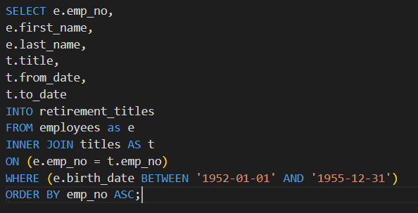
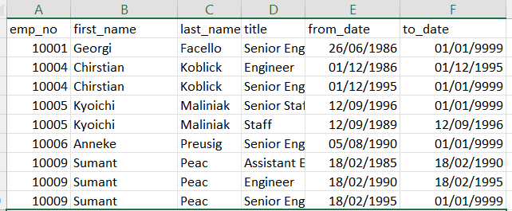
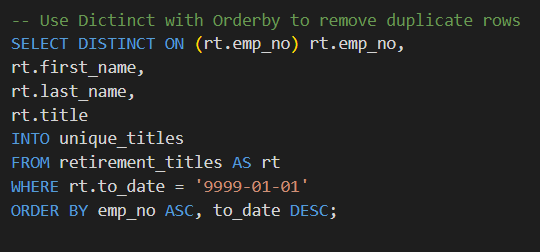
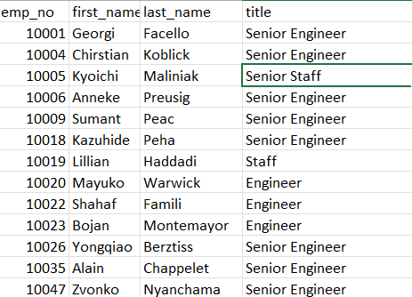
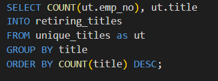
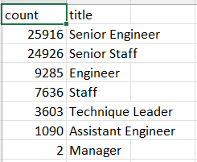
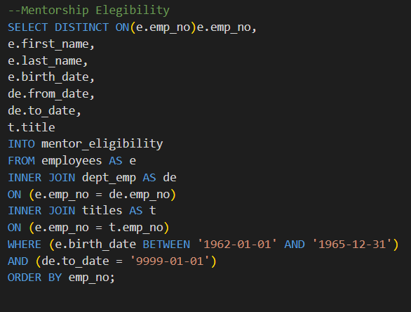
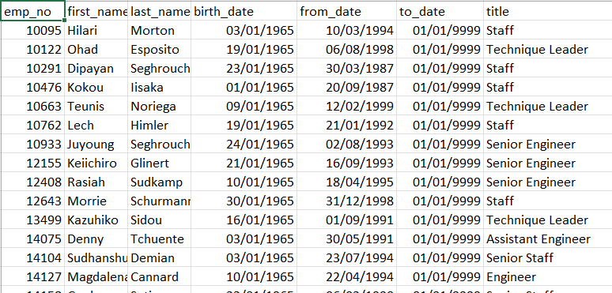

# Pewlett-Hackard-Analysis

## Overview of Pewlett-Hackard-Analysis

### Purpose
The purposes of this Challenge is to find the number of employees who will retire and sort them by job titles and identify who employees are eligible to participate in a mentorship program.

## Results
Provide a bulleted list with four major points from the two analysis deliverables. Use images as support where needed.

- The Number of Retiring Employees by Title

- Unique Titles

- The count of the number of employees by their most recent job title who are about to retire

- A mentorship-eligibility table that holds the current employees who were born between January 1, 1965 and December 31, 1965

  School District Analysis [Employee_Database_challenge.sql](Queries/Employee_Database_challenge.sql).

## Summary
Provide high-level responses to the following questions, then provide two additional queries or tables that may provide more insight into the upcoming "silver tsunami."

-How many roles will need to be filled as the "silver tsunami" begins to make an impact?

-Are there enough qualified, retirement-ready employees in the departments to mentor the next generation of Pewlett Hackard employees?

   
 
 

